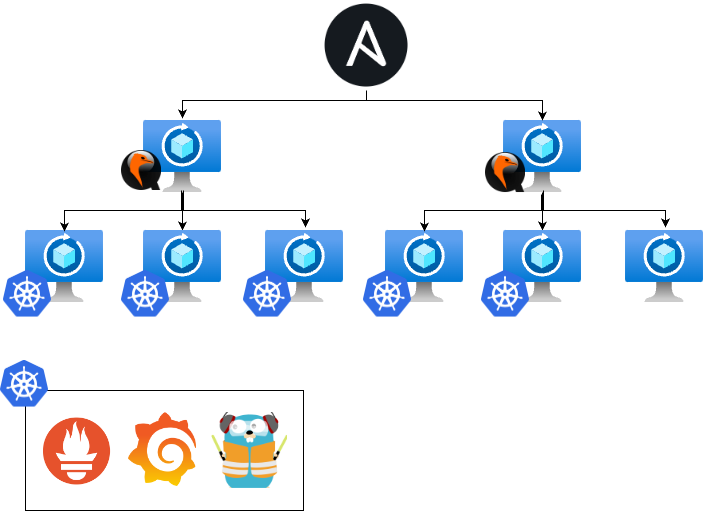

# Ansible cloud

This script creates private cloud infrastructure running kubernetes on alpine. It sets up qemu hypervisors and creates kubernetes nodes. It also installs prometheus-node-exporter on all of the machines.

## Infrastructure
